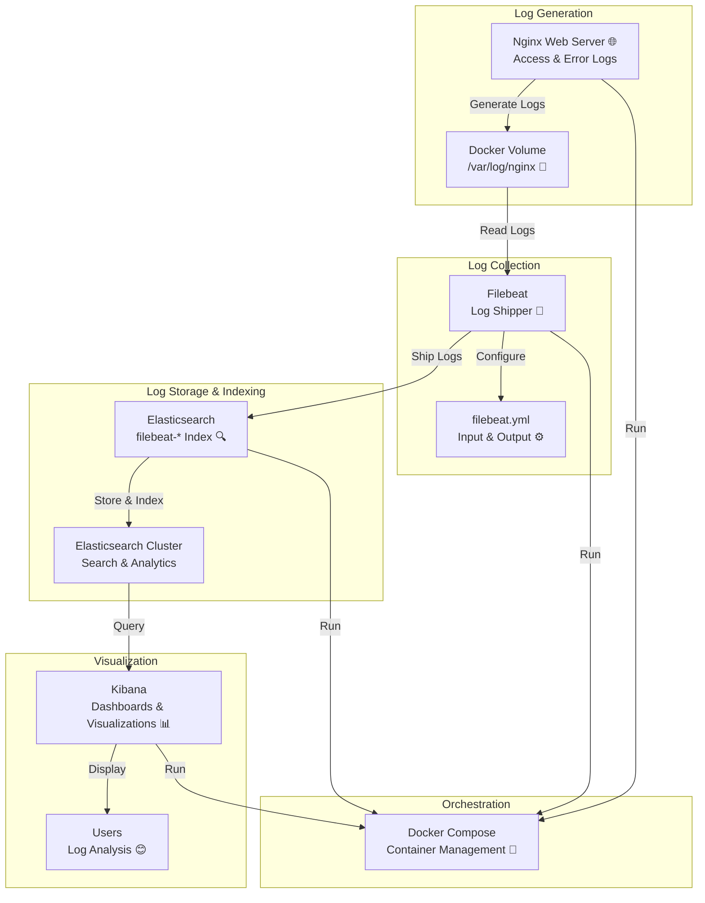

# 🌟 EFK Stack for Monitoring Nginx Logs 🚀

[](https://www.docker.com/)
[](https://www.elastic.co/elasticsearch/)
[](https://www.elastic.co/beats/filebeat)
[](https://www.elastic.co/kibana/)
[](LICENSE)

## 🎯 Project Overview

Welcome to the **EFK Stack for Monitoring Nginx Logs**! This project sets up an **EFK (Elasticsearch + Filebeat + Kibana)** stack using **Docker Compose** to monitor **Nginx** access and error logs in real-time. It provides a scalable, containerized solution for log collection, storage, and visualization, ideal for DevOps and system monitoring workflows. 🖥️

- **Nginx**: Generates web server logs.
- **Filebeat**: Collects and ships logs to Elasticsearch.
- **Elasticsearch**: Indexes and stores logs for fast querying.
- **Kibana**: Visualizes logs with interactive dashboards.

## 📑 Table of Contents

- [✨ Features](#-features)
- [📂 Project Structure](#-project-structure)
- [🛠 Prerequisites](#-prerequisites)
- [🚀 Setup Instructions](#-setup-instructions)
- [📡 Usage](#-usage)
- [🏗 Architecture](#-architecture)
- [📊 Monitoring](#-monitoring)
- [🧪 Testing](#-testing)
- [🧹 Cleanup](#-cleanup)
- [🔧 Troubleshooting](#-troubleshooting)
- [🤝 Contributing](#-contributing)
- [📜 License](#-license)

## ✨ Features

- **Real-time Log Monitoring**: Tracks Nginx access and error logs with Filebeat 📜.
- **Scalable Architecture**: Containerized with Docker Compose for easy deployment 🐳.
- **Log Persistence**: Uses Docker volumes to store logs across container restarts 💾.
- **Powerful Search**: Elasticsearch indexes logs for fast querying 🔍.
- **Interactive Dashboards**: Kibana visualizes log data with charts and tables 📊.
- **Automated Setup**: Script to configure Kibana index patterns ⚙️.
- **Customizable**: Easily extend with additional services or visualizations 🌐.

## 📂 Project Structure

```
Docker-Assignment/
├── docker-compose.yml           # 🐳 Defines Nginx, Filebeat, Elasticsearch, Kibana services
├── elasticsearch/              # 🔍 Elasticsearch configuration
│   └── Dockerfile
├── filebeat/                   # 📜 Filebeat configuration
│   ├── Dockerfile
│   └── filebeat.yml
├── kibana/                     # 📊 Kibana configuration
│   └── Dockerfile
├── nginx/                      # 🌐 Nginx configuration
│   ├── Dockerfile
│   └── logs/                   # 💾 Volume for Nginx logs
├── scripts/                    # 🛠 Helper scripts
│   └── setup-kibana-index-pattern.sh
└── README.md                   # 📖 Project documentation
```

## 🛠 Prerequisites

- 🐳 **Docker**: Version 20.10 or higher
- 🐳 **Docker Compose**: Version 1.29 or higher
- 🔍 **Optional**: `curl` for testing requests
- 🌐 **Browser**: For accessing Kibana and Nginx

Verify installation:
```bash
docker --version
docker-compose --version
curl --version
```

## 🚀 Setup Instructions

### 1. Clone the Repository
```bash
git clone <your-repo-url>
cd Docker-Assignment
```

### 2. Set Filebeat Permissions
Ensure `filebeat.yml` has correct permissions:
```bash
sudo chown root:root filebeat/filebeat.yml
sudo chmod 600 filebeat/filebeat.yml
```

### 3. Start the EFK Stack
Launch all services in detached mode:
```bash
docker-compose up -d
```

### 4. Configure Kibana Index Pattern
Run the setup script to create the `filebeat-*` index pattern:
```bash
bash scripts/setup-kibana-index-pattern.sh
```

## 📡 Usage

### Accessing Components
| Component       | URL                      | Default Credentials         |
|-----------------|--------------------------|-----------------------------|
| Nginx           | http://localhost:8080    | None                        |
| Kibana          | http://localhost:5601    | `elastic` / `changeme%`     |
| Elasticsearch   | http://localhost:9200    | `elastic` / `changeme%`     |

### Visualizing Logs in Kibana
1. Open Kibana at http://localhost:5601.
2. Log in with:
   - **Username**: `elastic`
   - **Password**: `changeme%`
3. Navigate to **Management → Stack Management → Index Patterns**.
4. Create an index pattern:
   - Name: `filebeat-*`
   - Time field: `@timestamp`
   - Click **Create**.
5. Explore logs in **Discover**.
6. Create visualizations (e.g., pie charts, line charts) in **Visualize** or dashboards in **Dashboard**.

**Suggested Visualizations**:
- **Pie Chart**: Response codes (`nginx.access.response_code`, e.g., 200, 404).
- **Line Chart**: Requests over time (`@timestamp`).
- **Table**: Top URLs (`nginx.access.url`).

## 🏗 Architecture

The diagram below details the EFK stack workflow for Nginx log monitoring:




## 📊 Monitoring

- **Filebeat**: Collects Nginx logs in real-time and ships them to Elasticsearch 📜.
- **Elasticsearch**: Indexes logs in `filebeat-*` for fast search and analysis 🔍.
- **Kibana**: Provides interactive dashboards for log visualization (e.g., response codes, request trends) 📉.

## 🧪 Testing

1. **Generate Nginx Logs**:
   ```bash
   curl http://localhost:8080/
   ```
2. **Check Nginx Logs**:
   ```bash
   docker exec -it nginx cat /var/log/nginx/access.log
   ```
3. **Verify Elasticsearch Indexing**:
   ```bash
   curl -u elastic:changeme% http://localhost:9200/_cat/indices?v | grep filebeat
   ```
4. **View Logs in Kibana**:
   - Go to **Discover** in Kibana to see `filebeat-*` logs.

## 🧹 Cleanup

To stop and remove the EFK stack:
```bash
docker-compose down
```
To remove volumes (deletes logs):
```bash
docker-compose down -v
```

## 🔧 Troubleshooting

- **Filebeat Permission Issues**:
  - Ensure `filebeat.yml` has `root:root` ownership and `600` permissions.
  - Run `sudo chmod -R 777 nginx/logs` if Filebeat cannot access logs.
- **Elasticsearch Not Starting**:
  - Check logs: `docker logs elasticsearch`.
  - Ensure port `9200` is free.
- **Kibana Index Pattern Missing**:
  - Verify `filebeat-*` index: `curl -u elastic:changeme% http://localhost:9200/_cat/indices?v`.
  - Re-run `setup-kibana-index-pattern.sh`.
- **No Logs in Kibana**:
  - Generate logs: `curl http://localhost:8080`.
  - Check Filebeat logs: `docker logs filebeat`.

For more help:
- [Elasticsearch Docs](https://www.elastic.co/guide/en/elasticsearch/reference/current/index.html)
- [Filebeat Docs](https://www.elastic.co/guide/en/beats/filebeat/current/index.html)
- [Kibana Docs](https://www.elastic.co/guide/en/kibana/current/index.html)

## 🤝 Contributing

We welcome contributions! 🙌
1. Fork the repository.
2. Create a branch: `git checkout -b feature-name`.
3. Commit changes: `git commit -m "Add feature"`.
4. Push: `git push origin feature-name`.
5. Open a pull request on GitHub/DagsHub.

## 📜 License

This project is licensed under the MIT License. See [LICENSE](LICENSE) for details.

---

*Built with ❤️ for real-time Nginx log monitoring using the EFK stack and Docker! 🖥️📊*
